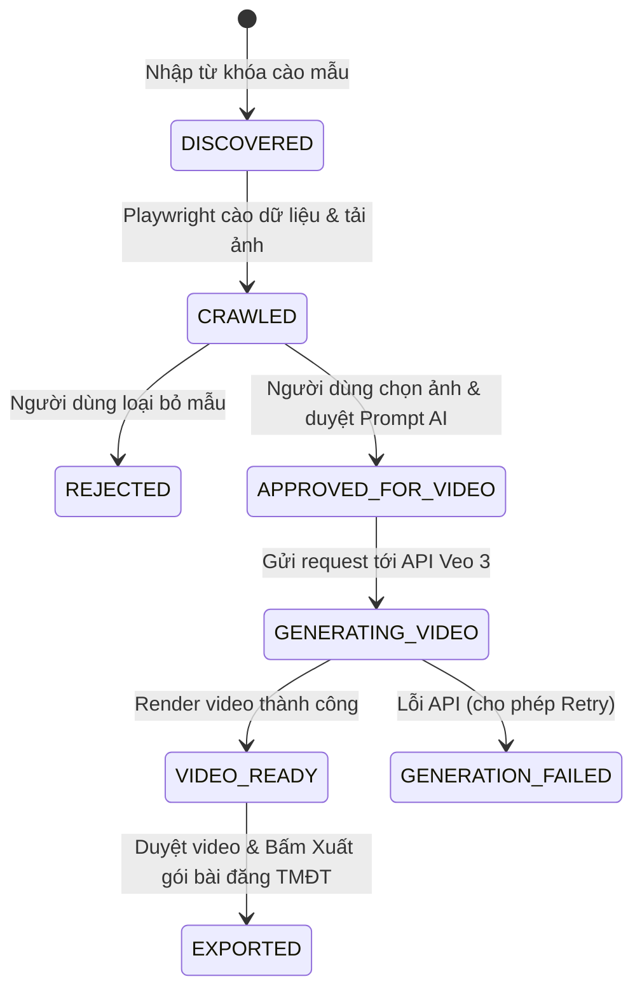

# 🚀 MakerWorld Auto-Video & E-Commerce Exporter Pipeline


Hệ thống tự động hóa cào dữ liệu mẫu in 3D từ **MakerWorld**, trích xuất thông tin chi tiết (ảnh, loại nhựa, màu nhựa, file 3D), tạo video quảng cáo sản phẩm bằng AI (**Google Veo 3** / AI Video API) theo cơ chế kiểm duyệt **Human-in-the-loop**, và tự động biên tập bài đăng chuẩn SEO xuất ra các sàn TMĐT (Shopee, TikTok Shop).

---

## 🌟 Tính Năng Nổi Bật

- **🌐 MakerWorld Scraper Engine (Playwright)**:
  - Cào tự động hàng loạt mẫu in 3D theo từ khóa tìm kiếm.
  - Phân tích bóc tách chính xác **Loại nhựa** (`PLA`, `PETG`, `TPU`, `ABS`...) và **Màu nhựa** (`Silk Gold`, `Matte Black`, `White`...).
  - Tải và lưu trữ tập trung ảnh sản phẩm chất lượng cao về ổ đĩa local (`./storage/raw_images/`).

- **🎛️ Human-in-the-Loop Web Dashboard (Next.js 14 + Tailwind CSS)**:
  - Giao diện Dark Mode hiện đại, tối ưu trải nghiệm người dùng.
  - Cho phép xem trước ảnh, chọn ảnh chính, kiểm duyệt thông tin và tùy chỉnh Prompt AI trước khi gửi request tốn chi phí.

- **🎬 AI Video Generation Pipeline (Veo 3 Integrator)**:
  - Tự động dựng Prompt AI chuyên nghiệp chuẩn studio 3D:
    > *"A 3D printed [Title] made of premium [Filament Type] plastic filament in [Filament Color] color, cinematic studio lighting, 360 degree rotating showcase camera spin, high detail photorealistic 4k."*
  - Kết nối API Veo 3 / Google AI Video, hỗ trợ chế độ **Mock mode** thử nghiệm local không tốn credit API.

- **📦 E-Commerce Exporter Engine**:
  - **Shopee Exporter**: Tự động sinh tiêu đề chuẩn SEO $\le 120$ ký tự và mô tả chi tiết bài đăng (thông số vật liệu, thời gian in, trọng lượng, hashtags).
  - **TikTok Shop Exporter**: Tự động tạo file cấu hình `tiktok_metadata.json`.
  - **Packager**: Đóng gói toàn bộ video MP4 + ảnh sản phẩm + nội dung bài đăng vào thư mục `./storage/export_packages/{product_id}/`.

- **⚡ Queue & Database Architecture**:
  - Cơ sở dữ liệu SQLite cực nhẹ với Drizzle ORM (`./data/app.db`).
  - Hàng đợi bất đồng bộ BullMQ + Redis xử lý ngầm 3 luồng: `crawler-queue`, `video-gen-queue`, `export-queue`.

---

## 📐 Kiến Trúc Vòng Đời Sản Phẩm (Workflow State Machine)



---

## 📁 Cấu Trúc Thư Mục Lưu Trữ Media Local

```
Auto-Video/
├── app/                        # Next.js App Router (UI Dashboard & API Routes)
│   ├── discovery/              # Bước 1: Duyệt mẫu cào về & chọn ảnh
│   ├── studio/                 # Bước 2: Xem video AI & sửa copywriting
│   ├── exports/                # Bước 3: Quản lý các gói bài đăng hoàn chỉnh
│   └── api/                    # Serverless API routes (crawler, video, export)
├── lib/
│   ├── db/                     # SQLite database schema (Drizzle ORM)
│   ├── queue/                  # BullMQ Redis queue definitions
│   ├── worker/                 # Background queue workers
│   ├── crawler/                # Playwright MakerWorld scraper & filament parser
│   ├── video-gen/              # Veo 3 API integrator & prompt engineering
│   └── exporter/               # Shopee/TikTok SEO formatters & zip packager
├── data/                       # Lưu trữ file Database SQLite (app.db)
└── storage/                    # Lưu trữ media đĩa local
    ├── raw_images/             # Ảnh sản phẩm cào về từ MakerWorld
    ├── generated_videos/       # File MP4 video do Veo 3 sinh ra
    └── export_packages/        # Gói hoàn thiện sẵn sàng tải lên sàn TMĐT
```

---

## 🛠️ Hướng Dẫn Cài Đặt & Chạy Dự Án

### 1. Yêu cầu hệ thống
- **Node.js**: v18.0.0 trở lên
- **Redis Server**: Đang chạy trên `localhost:6379` (cho BullMQ Queue)

### 2. Cài đặt các gói phụ thuộc
```bash
npm install
```

### 3. Khởi động Web Dashboard
```bash
npm run dev
```
Truy cập giao diện Web tại: **`http://localhost:3000`**

### 4. Khởi động Background Worker (BullMQ Queue)
```bash
npm run worker
```

---

## 🧪 Kiểm Thử (Testing)

Dự án đi kèm bộ kiểm thử tự động toàn diện với **Vitest**:

```bash
npm test
```

**Kết quả kiểm thử:**
```bash
 ✓ tests/db.test.ts (1 test)
 ✓ tests/video-gen.test.ts (3 tests)
 ✓ tests/exporter.test.ts (3 tests)
 ✓ tests/crawler.test.ts (4 tests)
 ✓ tests/queue.test.ts (1 test)

 Test Files  5 passed (5)
      Tests  12 passed (12)
```

---

## 📜 Giấy Phép (License)

Dự án được phát triển dưới giấy phép [MIT License](LICENSE).
