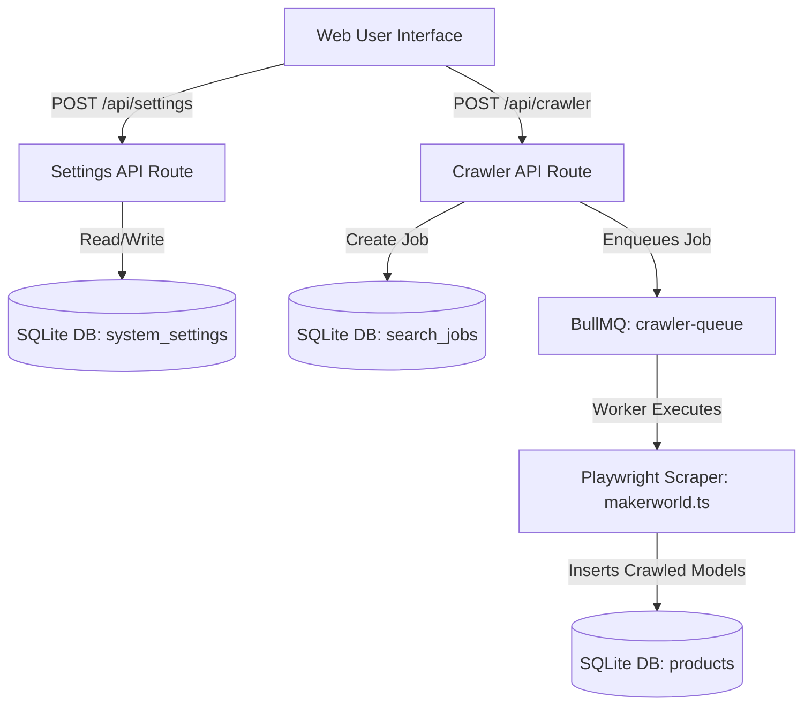

# 🛠️ System Design Specification: Keyword Crawler & API Settings Manager

This document specifies the design for the **API Credentials Configuration System** and the **Keyword Crawler Management Panel** for the **Auto-Video Pipeline**.

---

## 🏛️ Architecture & Component Overview



---

## 💾 1. Database Schema Extensions (`lib/db/schema.ts`)

### New Table: `system_settings`
```typescript
export const systemSettings = sqliteTable('system_settings', {
  key: text('key').primaryKey(),
  value: text('value').notNull(),
  updatedAt: text('updated_at').notNull(),
});
```

### Supported System Setting Keys:
- `veo_api_key`: API key for Google Veo 3 / Video Generation.
- `gemini_api_key`: API key for Gemini Copywriting & Subtitle Synthesizer.
- `ai_mode`: `'mock'` (no API cost) | `'live'` (real API calls).
- `max_crawl_items`: Default limit of items per keyword crawl job (default: `10`).

---

## 🌐 2. Web Interface & UI Components

### Component 1: System Settings Page (`app/settings/page.tsx`)
- **API Credentials Card**:
  - `Veo 3 API Key` input with mask toggle (`••••••••`).
  - `Gemini API Key` input with mask toggle (`••••••••`).
  - `AI Execution Mode` toggle switch (`Mock Mode` $\leftrightarrow$ `Production Live Mode`).
- **Crawler Defaults Card**:
  - `Default Max Crawl Count` selector (`5`, `10`, `20`, `50`).
- **Save Button**:
  - Submits form to `POST /api/settings` and displays toast notification.

### Component 2: Keyword Control Panel (`app/discovery/page.tsx`)
- **New Crawl Job Form**:
  - Keyword input supporting single keyword or comma-separated list (`articulated dragon, phone stand`).
  - Depth limit selector (`5`, `10`, `20`).
  - Submit button: `"🚀 Khởi động Cào Hàng Loạt"` (Triggers `POST /api/crawler`).
- **Search Jobs History Table**:
  - Real-time polling table listing: `Job ID`, `Keyword`, `Target Count`, `Items Found`, `Status` (`PENDING`, `RUNNING`, `COMPLETED`, `FAILED`), `Created At`.

---

## ⚡ 3. API Endpoints

### `GET /api/settings`
- Returns key-value dictionary of all system settings.

### `POST /api/settings`
- Receives JSON payload `{ veo_api_key, gemini_api_key, ai_mode, max_crawl_items }`.
- Upserts settings in `system_settings` SQLite table.

### `GET /api/crawler`
- Returns JSON list of recent `search_jobs`.

### `POST /api/crawler`
- Parses keyword list and limit.
- Creates `search_jobs` record in SQLite.
- Enqueues job to BullMQ `crawler-queue`.

---

## 🧪 4. Testing & Verification Plan

1. **Database Test**: Unit test SQLite `systemSettings` table upsert and retrieve.
2. **API Endpoint Test**: Test `/api/settings` GET and POST responses.
3. **Crawler Job Queue Test**: Test submitting keyword job via `/api/crawler` and verifying job status in `search_jobs`.
4. **End-to-End Test**: Verify full flow from UI `/settings` and `/discovery` to BullMQ worker execution.
